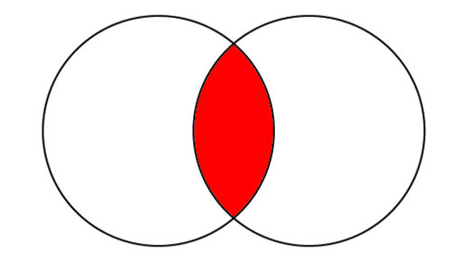
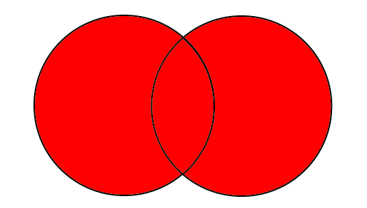
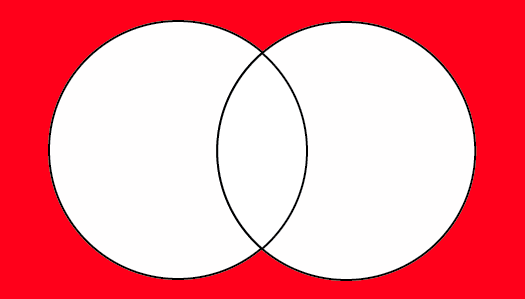
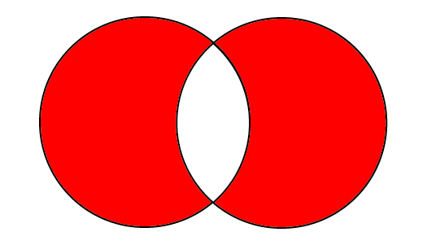

## What's Boolean Algebra?

Boolean Algebra is one of the **fundamentals of Computer Science**, **Signals Processing, Information Theory, and more.**

This mathematical field differs slightly from all others. While classic algebra works with numbers, boolean algebra concerns conditions and deals with **bits**.

A **bit is a fundamental unit** of a logical state, which can be either 0 or 1. As you probably know, boolean algebra uses the **binary system.** 0 = false, while 1 = true.

Starting from here, we can now describe Boolean Algebra **operators**, and later some examples in some programming languages.

## NOT

The Negation is a **unary operator.** It affects a single value, switching its value. So, if A = 1, not A = 0.

The **negation operator** is called **NOT.** We can denote it with the tilde ~, the ¬ symbol, or the exclamation point !.

Using a [truth table](https://en.wikipedia.org/wiki/Truth_table) can help you visualize its meaning.

| A   | not A |
| --- | ----- |
| 0   | 1     |
| 1   | 0     |

## AND

The **Logical Conjunction,** commonly noted as **AND**, is a binary operator.

Differently from unary operator, **binary operators** need to work with **two variables.**

The Logical Conjunction states that if two variables equal to true, their result will also be true. Any other case will be false.

We can denote the **AND** operator with the ∧ symbol or with &&.

You can think of the Logical Conjunction as a **multiplication**. If you multiply anything by 0, the result will be 0.

| A   | B   | A and B |
| --- | --- | ------- |
| 0   | 0   | 0       |
| 1   | 1   | 1       |
| 0   | 1   | 0       |
| 1   | 0   | 0       |

Graphically speaking, a Venn diagram can easily describe this concept. Sure enough, this operator denotes an intersection of two sets.

If you have no clue what I am talking about, go look for [Set Theory](https://en.wikipedia.org/wiki/Set_theory).



## OR

The **OR operator** is another binary operator.

The OR operator declares that if two variables equal to true, the result will also be true. Any other case will be false.

We can denote the **OR** operator with the ∨ symbol or with ||.

| A   | B   | A or B |
| --- | --- | ------ |
| 0   | 0   | 0      |
| 1   | 1   | 1      |
| 0   | 1   | 1      |
| 1   | 0   | 1      |

Differently from the AND operator, you can think about the OR Operator as a **sum.** So, any two statements that sum to 1 will be true, else false.



## NOR

There's not much to say about **NOR.** It is the **exact opposite of the OR** **operator**.

It's the same as using the NOT operator on the OR results - NOR = NOT OR.

| A   | B   | A or B |
| --- | --- | ------ |
| 0   | 0   | 1      |
| 1   | 1   | 0      |
| 0   | 1   | 0      |
| 1   | 0   | 0      |



## XOR

The **XOR operator**, extended to **Exclusive OR** is similar to the normal OR operator. The main difference is that it results in false once the two statements are both true.

| A   | B   | A or B |
| --- | --- | ------ |
| 0   | 0   | 0      |
| 1   | 1   | 0      |
| 0   | 1   | 1      |
| 1   | 0   | 1      |



## Some examples

Let's now see an example in some programming languages.

When programming, boolean expressions can help you with conditionals. At a higher level, boolean maths can be applied to actual math problems and programs.

## JavaScript

```JavaScript
const password = "example";
const isLogged = true;

// AND && + NOT !
if ( !isLogged && (password == "example")) {
    console.log("Welcome back!");
} else if (isLogged) {
    console.log("You are already logged in!")
} else {
    console.log("Incorrect password!")
}
```

## C&#35;

```csharp
string password = "example";
bool isLogged = true;

if ( !isLogged && (password == "example") )
{
    Console.WriteLine("Welcome back!");
}
else if (isLoaded)
{
    Console.WriteLine("You are already logged in!");
}
else
{
    Console.WriteLine("Incorrect password!");
}
```

## Python 3

```Python
passoword = "example"
isLogged = True

if not(isLogged) and password == "example":
    print("Welcome back!")
elif isLogged:
    print("You are already logged in!")
else:
    print("Incorrect password!")
```
