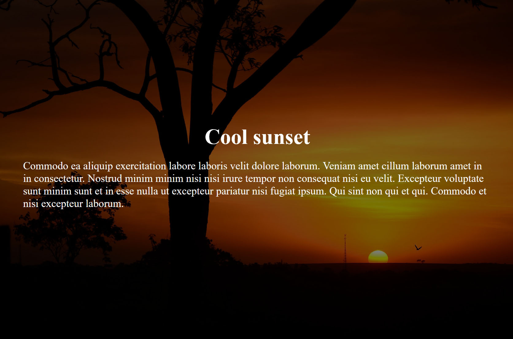

## The problem

When creating a website, making the **text readable** is one of the key points we must keep in mind. Specifically, when placing **text over images**, we must find the most adapting **CSS** style to implement.

## Implementations

It is possible to solve this problem by using **only CSS**. I'm using a div with `background-image` rather than the **img tag**, as it is more functional and editable.

## High Contrast Image

The **easiest** method is using a high contrast image. All we have to do is picking the **right text color**. This method is limited, as we should adjust the font color based on the image color scheme.

As you can see, the text is still slightly hard to read.

## Text Shadow

Another useful method is using `text-shadow`, creating a contrast between the elements we're displaying.

```css
h1,
p {
  color: black;
  text-shadow: 0.02em 0 lightgray, 0 0.02em lightgray;
}
```


## Transparent Overlay

Creating a **transparent overlay** over the image works out greatly most of the time. Depending on the image, the text, or the context, you can experiment with different color patterns.

```css
#image {
  position: relative;
  width: 1400px;
  height: 900px;
  background-image: url('./sunset.jpg');
  background-position: center;
  background-size: cover;
  display: flex;
  flex-direction: column;
  justify-content: center;
  align-items: center;
  padding: 4%;
}

#image::before {
  content: '';
  position: absolute;
  top: 0;
  left: 0;
  display: block;
  background: rgba(0, 0, 0, 0.5);
  width: 100%;
  height: 100%;
}

#image > h1,
#image > p {
  z-index: 1;
  color: white;
}
```


The result is similar to the first method, in addition, the text is indeed more readable.

## Blurred Image

Similarly to the **transparent overlay**, a **blurred image** can make reading the text a lot simpler. It is possible to change the **blur** intensity through parameters.

```css
#image {
  position: relative;
  width: 1400px;
  height: 900px;
  display: flex;
  flex-direction: column;
  justify-content: center;
  align-items: center;
  padding: 4%;
}

#image::before {
  content: '';
  position: absolute;
  top: 0;
  left: 0;
  display: block;
  width: 100%;
  height: 100%;
  background-image: url('./sunset.jpg');
  background-position: center;
  background-size: cover;
  filter: blur(4px);
}

#image > h1,
#image > p {
  z-index: 1;
  color: white;
}
```

Bear in mind, when using filter children are affected as well. Using the `::after` pseudo element solves this problem.

## Conclusion

What we have seen here are some of the most used methods to create **readable text** over **images.**

These techniques can be used on any **framework** or **library** out there using **CSS**, such as [**ReactJS**](/react-for-beginners/), **Angular**, **Vue**, and more.
