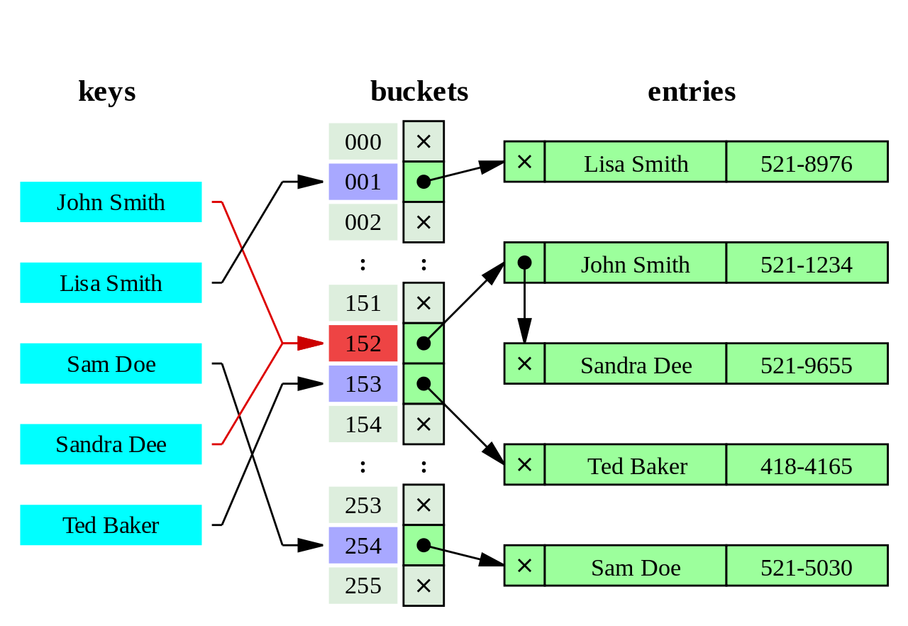
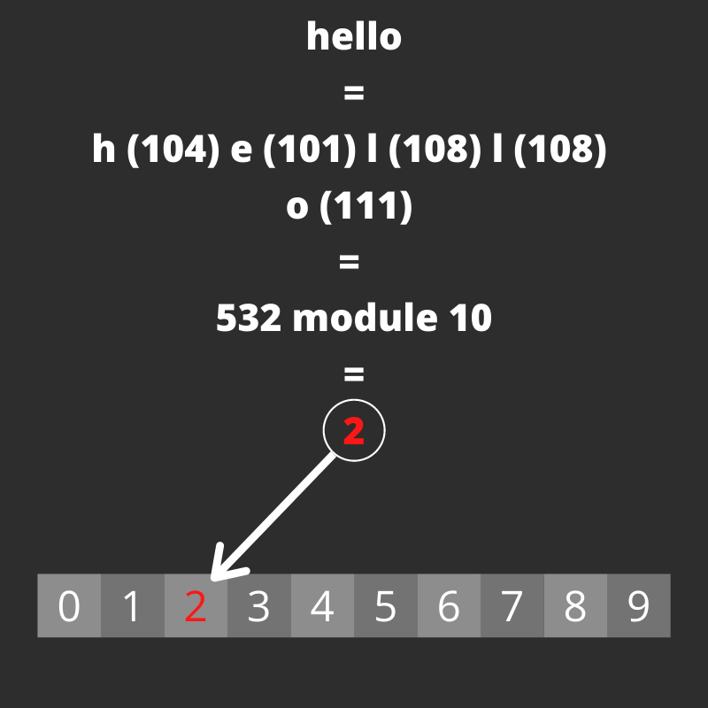

## What are Hash Tables?

Hash Tables are a crucial part of **Computer Science**. They are one of the most used Data Structures, and they allow **fast and efficient** **data retrieval independently from the size of the data set**.

This Data Structure allows converting data into a convenient numeric index pointing to a specific item in an Array. Knowing the position of any item consent us to access it in constant time O(1).

## Some use cases

Between the very use cases for Hash Tables, we can find **Database Indexing**, allowing almost instantaneous data retrieval from large data sets.

Moreover, we can find Hash Tables in caching, error checking, sets, associative Arrays, and more.

## How does it work?

The main point of Hash Tables is uniquely identifying data. To do so, we will need a **Hash Function**.

A Hash Function converts any piece of information into an unique Array index (each cell is usually called Bucket). We can then store the object inside a **definite and calculable position**.

Once you got a way to calculate indexes directly from the data you're looking for, implementing a search method is as easy as retrieving that same index with the Hash Function, and using it to access the Array.

The same concept applies to deleting and editing objects.



### A simple example

You can store virtually **any data type** inside a Hash Table. For the sake of simplicity, let's take, as an example, a set of strings we need to place somewhere.

Now, if we want to store these strings, we need a Hash Function to convert them into numbers.

We could merely take each string character **ASCII** code, which is, in fact, a number, and summing char codes together. At this point, we need to map those values to the Array's potential positions.<br />
For this purpose, we can take the resulting number and diving it by the Array's size.<br />
By taking the division reminder, we can ensure we'll never get an index out of range.

Let's take the string `'hello'`, for example. We can split it into characters and sum their ASCII values. Which will result in:

```csharp
h (104) e (101) l (108) l (108) o (111) = 532
```

If we'd have an Array of 10 elements, 532 would be out of range. We can solve this by calculating `532 % 10 = 2`. 2 is now `'hello'` position inside the Array.

In code, it will look similar to this (example in C#):

```csharp
// The key is the string value (we chose to store stings)
// This example does not considerate collisions
public int Hash(string key)
{
    int sum = 0;
    foreach (char c in key)
    {
        sum += c;
    }

    return sum % this.buckets.Length;
}
```

And here it's an illustration of the procedure.



### Collisions

However, Hash Functions can cause some problems. We're mapping an infinite number of strings to a finite number of indexes. Eventually, we'll run into two sequences of characters with the same calculated index value.

In this case, a **Collision** happens. We need to find a way to get another free spot inside the Array.

For instance, the word `'collision'`, when passing through the previous Hash Function, will produce an index of `2`, just as the word `'hello'` did.

There're different ways to surpass this problem. Every single one has its advantages and disadvantages. Finding a fitting solution depends on each case.

I may talk about Collisions Resolutions in the future. For now, I'll end this here.

## Disadvantages of Hash Tables

Hash Tables are highly efficient for many use cases. Still, they're not always a go-to.

For instance, using them with a **few values to store can get inefficient**, as computing the Hash Function could require more time than searching through a simple Array.

**Collisions are practically unavoidable** and will always require some workaround. On the same line, many Collisions lead to a slower execution. When dealing with Collisions, looking for an object will most likely require more time than a Collision-less set.

**Hash Tables can have multiple empty spots**, leaving allocated space in memory with no use.

## After all of this, why learning this?

Getting to know how Data Structures work and where they work best is crucial in problem-solving.
Data Structures are language-independent and can be applied to many
situations.

Besides, people could ask you about these during Coding Interviews.
