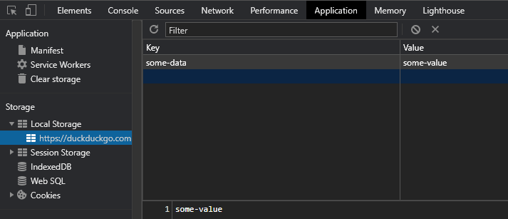

## What's Local Storage

Local Storage is part of the HTML Web API. It works similarly to cookies, but they're manageable directly from [JavaScript](/category/javascript/) on the client.

## Why using Local Storage

Local Storage works like a **persistent** cookie. It doesn't have any expiration date, and it will stay in the user's pc for an undetermined time.

Moreover, it does not require to transfer data anywhere as everything remains on the browser. By using Local Storage, you can **avoid using additional bandwidth** with every HTTP request.

Moreover, Local Storage can hold up to **5 MB** of data per client. In comparison, cookies can hold a maximum of 4 KB.

For instance, I used Local Storage to save user's settings about my [blog's theme](https://github.com/armanimichael/armanimichael-blog/blob/master/src/containers/Layout/Layout.tsx).

Storing highly sensitive information is not recommended. For that purpose, you should use cookies. Data stored inside the browser is accessible from JavaScript so, it can be vulnerable to cross-site scripting attacks.

## Using Local Storage

You can access, edit, and create Local Storage data from JavaScript. Note that, when a user using Incognito Mode, data is not persistent and will clean after the user closes the page. <br />
Another thing to remember is that Local Storage is **specific to the protocol of the page**. The HTTP and HTTPS protocols are independent of each other, and this is another good reason to redirect everything over to HTTPS.

You can access the Storage object by using `window.localStorage`.

Preferably, if you wish to **access** a particular item stored inside the Local Storage, you can use the following method. The method will return null if you're trying to access a nonexistent data.

```javascript
const data = window.localStorage.getItem('some-data');
```

You can also **create** a new data item.

```javascript
window.localStorage.setItem('some-data', 'some-value');
```

If you want to **delete a single item**, you can use the following syntax.

```javascript
window.localStorage.removeItem('some-data');
```

Finally, you can **delete every Local Storage item**.

```javascript
window.localStorage.localStorage.clear();
```

## Inspecting Local Storage

You can inspect and debug Local Storage items directly from the browser. All you have to do is debug the page with F12, go to the Application section, and click on Local Storage.



## ReactJS Example

Let's briefly see a use example by using [React](/category/react/). There are two ways to do this, using hooks from within a functional component or using class components and [lifecycle events](/reactjs-lifecycle-events/).

React works asynchronously, so we need to keep track of any Local Storage variation. For example, let's write something similar to my blog's theme preference function.

### Class Component

In a Class Component we'll be using `componentDidMount` to fetch any existing Local Storage item.

```javascript
import React, { Component } from 'react';

class Theme extends Component {
  // Default state - in case Local Storage was empty
  state = {
    theme: 'light',
  };

  // Fetching browser's Local Storage
  componentDidMount() {
    const theme = localStorage.getItem('theme');

    if (theme) {
      this.setState({ theme });
    }
  }

  // Updating Theme on click
  handleClick = () => {
    const { theme } = this.state;

    if (theme === 'light') {
      localStorage.setItem('theme', 'dark');
      this.setState({ theme: 'dark' });
    } else {
      localStorage.setItem('theme', 'light');
      this.setState({ theme: 'light' });
    }
  };

  render() {
    const { theme } = this.state;

    return (
      <h1
        style={{
          color: theme === 'light' ? 'white' : 'black',
          background: theme === 'light' ? 'black' : 'white',
        }}
        onClick={this.handleClick}
      >
        I'm themed!
      </h1>
    );
  }
}
```

### Functional Component

By using a Functional Component instead we'll need to use hooks, this will also make the script shorter.

In particular, we'll need `useState` and `useEffect`. `useEffect` will replace `componentDidMount` once we pass an empty array as second argument.

```javascript
import React, { useState, useEffect } from 'react';

const Theme = () => {
  // Default state - in case Local Storage was empty
  const [theme, setTheme] = useState('light');

  // Fetching browser's Local Storage
  useEffect(() => {
    const loadedTheme = window.localStorage.getItem('theme');
    setTheme(loadedTheme || 'light');
  }, []);

  // Updates Local Storage - useEffect runs only once theme's value changes
  useEffect(() => {
    window.localStorage.setItem('theme', theme);
  }, [theme]);

  // Updating Theme on click
  const handleClick = () => {
    setTheme(theme === 'light' ? 'dark' : 'light');
  };

  return (
    <h1
      style={{
        color: theme === 'light' ? 'white' : 'black',
        background: theme === 'light' ? 'black' : 'white',
      }}
      onClick={handleClick}
    >
      I'm themed!
    </h1>
  );
};
```
