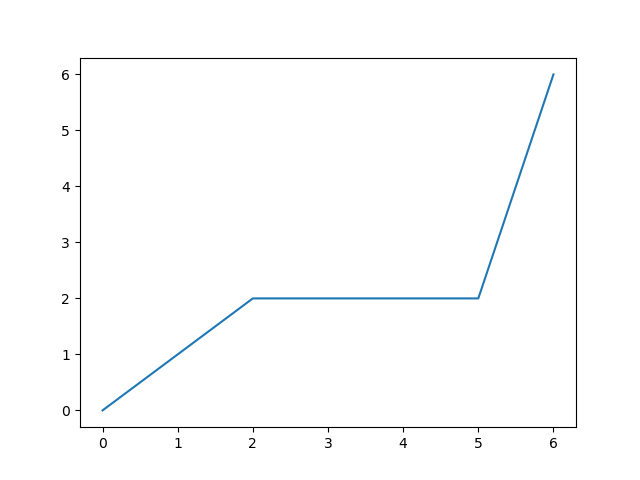
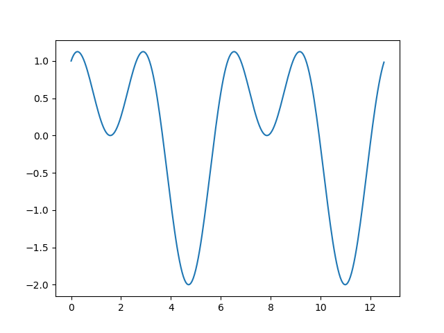
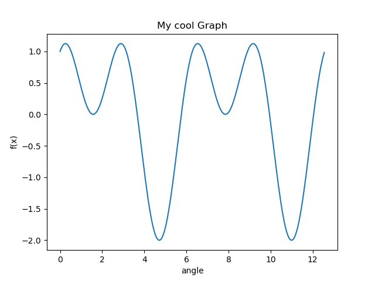
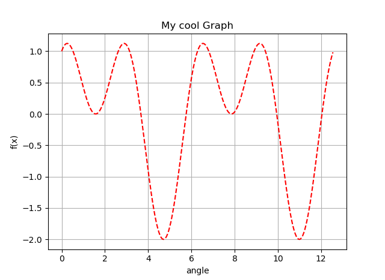

Python is an excellent programming language. It's a **multi-purpose** language and, its uses cases are unlimited.

For instance, it's widely used in **statistics** and **math** in general.

Let's see how to plot graphs using a Python library called **matplotlib**.

## Main concepts

Matplotlib graphs data into:

- **Figures**: the rendered windows
- **Axes**: where data renders into coordinates (cartesian, polar, etc.)

## Plotting points

The simplest way to plot data on a graph is by **points**.

To do so, we can use the `Axis.subplots()` method. After that, we can use `Axis.plot()` to plot the actual points.

```python
import matplotlib.pyplot as plt

# Coordinates
x = [0, 2, 5, 6]
y = [0, 2, 2, 6]

# Creating a Figure with an Axis
fig, ax = plt.subplots()
ax.plot(x, y)

# Displaying the graph
plt.show()
```



## Plotting functions

Another simple way to plot data is from a **mathematical function**.

In this case, we need to import `numpy` as well. This module lets us generate an array of points.

```python
import numpy as np
```

We can then generate these points using the `arange()` function. The first two parameters represent the **starting and ending points**, while the third is the **step**.

```python
# Generating an array of point from 0 to 2PI
x = np.arange(0, math.pi*2, 0.05)
```

You can also plot multiple functions, or points, on the graph by calling the `plot` method multiple times.

If we use a math function to calculate **y** points, we can graph whatever we like.

For example, let's plot the graph for the function f(x) = sin(x) + cos(2x)

```python
from matplotlib import pyplot as plt
import numpy as np

# PI
from math import pi as PI

# Creating two arrays for x and y
x = np.arange(0, PI * 4, 0.05)
y = np.sin(x) + np.cos(2 * x)

# Plotting the points
plt.plot(x, y)

# Displaying the graph
plt.show()
```



## Formatting the Graph

It is possible to change how the graphs look. We can add captions, change colors, changing line style, etc.

### Adding labels

As we may want to generate an image from a graph, adding some **labels** can make it immediately clear to the user what they're watching.

We can write a **title** and **naming axis**, for example.

```python
plt.xlabel("angle")
plt.ylabel("f(x)")
plt.title("My cool Graph")
```

If we apply this to the previous graph, we'll get this:



### Editing colors, Line-styling and adding a grid

Moreover, it's possible to **edit colors**. We can use some special characters and passing them as the third element of the plot.

Here you can see the color codes:

- b - Blue
- g - Green
- r - Red
- c - Cyan
- m - Magenta
- y - Yellow
- k - Black
- w - White

You can also use **CSS color codes**.

If you combine these codes with these symbols "- , –, -., , . , , , o , ^ , v , < , > , s , + , x , D , d , 1 , 2 , 3 , 4 , h , H , p , | , \_", you can change the line pattern.

Furthermore, you can **add a grid behind the graph**.

Let's apply this:

```python
plt.grid(True)
plt.plot(x, y, "r--")
```



## Conclusion

This library does way more than this, for now, let's stick with some simple stuff.
