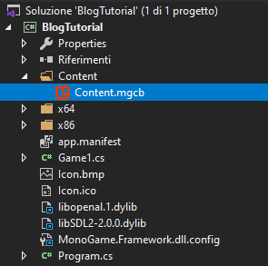

## Premise

As I mainly work on **Windows** (and I have no access to macOS), this tutorial is going to teach you about setting up a **MonoGame project** in **Visual Studio** on **Windows**.

If you're interested in setting up a **MonoGame project** for any other **OS**, you should [MonoGame's website](http://www.monogame.net/documentation/?page=Setting_Up_MonoGame) out.

## Installing MonoGame

The best way to work with **MonoGame** is to implement it in **Visual Studio**. VS provides us with some useful tools such as **Unit Testing** and **debugging tools**. Further, we can use a blank project template.

All you need to do is getting **Visual Studio** from Microsoft's website (**VS Community** is the free version) and installing it.

After that, just download [MonoGame](http://www.monogame.net/downloads/) from their website and install it.

## Creating your first project

Setting up a **MonoGame** project in **Visual Studio** is straightforward, MonoGame provides us with some **project templates** which can start with.

When creating a new project select **"_Monogame Cross-Platform Desktop Project_"**.


<center>
  <p>
    My installation is in Italian, but it should make sense just to provide a
    context.
  </p>
</center>

## Analyzing the project structure

Pretending you already have some **C# knowledge**, **I'm going to skip any explanation about the Main method**.

Any **MonoGame project** follows a standard pattern. The starting point of a MonoGame project is what's called by default `Game1.cs`.

When you work with **MonoGame**, all of your **game logic** runs in `Game1.cs`.

Let's see what **methods** the `Game1` class contains:

- `Initialize` contains all the **non-graphic related content,** running before the game execution. Here, for example, we could initialize our classes.
- `LoadContent` runs once per game and **loads** all the imported content, such as **Textures** and **Audio**.
- `UnloadContent` is the **opposite of LoadContent**: it **unloads** unused resources once per game.
- `Update` is where most of the main **game mechanics** run, by **updating** the game time. This method lets us create the **interactivity** needed by any game, such as **collisions detection** and **input handling**.
- `Draw`, similarly to `Update`, it **runs multiple times**. Inside `Draw`, we create the **visual aspects** of our game, placing **textures** on the scene.

## Displaying a Sprite

With everything clarified, we can start designing the bases of our first game. For now, we're going to **hard code** everything into the **Game1 class** (I will write some articles about OOP later on).

As an example, I'm going to use [this](https://www.piskelapp.com/p/agxzfnBpc2tlbC1hcHByEwsSBlBpc2tlbBiAgKDl7ICeCAw/view) as our **player.** I didn't make this, a friend of mine did. I suck at drawing.

### Using the Pipeline Tool

To **import** the **texture**, we're going to use MonoGame's **pipeline tool**. You can find it on the **rightmost** VS window (as shown underneath). You can open with a **double-click**.

In case it opens into the editor, you can open it via: `left-click / Open with / MonoGame Pipeline Tool`


This tool lets us import different file formats into our project without writing any line of code.

Let's import the sprite we're going to display in our game.

```shell
Right Click / Add / Exiting Item...
```

And then build it

```shell
Build / Build (OR F6)
```


### Displaying the Player

Firstly, create a class variable of type `Texture2D` and name it whatever you like.

```csharp
public class Game1 : Game
{
    GraphicsDeviceManager graphics;
    SpriteBatch spriteBatch;

    private Texture2D player;

...
```

We can now load the player's texture from the `LoadContent` method.

```csharp
...

protected override void LoadContent()
{
    // Create a new SpriteBatch, which can be used to draw textures.
    spriteBatch = new SpriteBatch(GraphicsDevice);

    // Specify the var type (Texture2D) and pass the name of the
    // texture as it appears into the pipeline tool
    player = Content.Load<Texture2D>("random_player");

    // TODO: use this.Content to load your game content here
}

...
```

We can now actually **draw the player** inside the `Draw` method.

```csharp
...

protected override void Draw(GameTime gameTime)
{
    GraphicsDevice.Clear(Color.CornflowerBlue);

    // spriteBatch is used to draw textures
    // All the drawings go between
    // spriteBatch.Begin(); and spriteBatch.End();
    spriteBatch.Begin();

    // The minumalist overload for spriteBatch.Draw();
    // requires the texture used (Texture2D)
    // a placing position (Vector2)
    // and a color (Color)
    spriteBatch.Draw(
        player,
        new Vector2(0, 0),
        Color.White
    );

    spriteBatch.End();

    base.Draw(gameTime);
}

...

```

If you **run the code** (F5) you should see something like this:


Finally, we have our first **scene running**, in the next article about **MonoGame**, I'll show you how to make the [player more interactive adding inputs](/monogame-move-sprite/).
